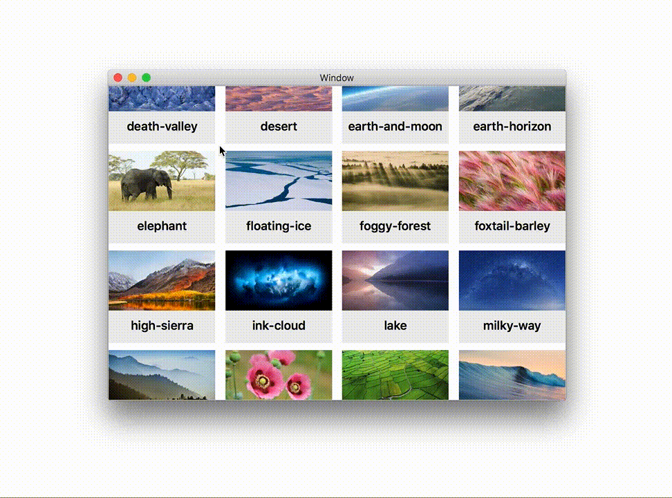

# NSCollectionView Drag and Drop
Issue with NSCollectionView's default drag and drop implementation

## Sample project
This is a sample project to demonstrate an issue I'm having when using the Drag and Drop behaviour for multiple items in `NSCollectionView`.

## Issue
I want to recreate the Drag and Drop behaviour of the macOS Photos.app: when selecting multiple items to reorganise them, the items are animated **quickly** into a **pile** formation (a seemingly randomly assorted pile of images). 


The default implementation of `NSDraggingDestination` provided by `NSCollectionView` seems to have a few issues: 
- slow to animate the flock of images when dragging multiple items and moving the cursor (see gif below) 
- setting the `NSDraggingInfo`'s or `NSDraggingSession`'s `draggingFormation` property doesn't seem to have any effect, anywhere I set it



## Possible solutions
**NOT** making the NSCollectionView a valid destination by **not** implementing: 
- `collectionView(_:writeItemsAt:to:)` nor 
- `collectionView(_:pasteboardWriterForItemAt:)` 
seems to fix both issues (probably because the destination defaults to a superview, which relies on a `NSView`'s default implementation of `NSDraggingDestination`). But it introduces a new obvious issue: The CollectionView is not a drop destination anymore...

Also, opting out of `NSDraggingDestination`'s default implementation provided by `NSCollectionView` by simply overriding `draggingEntered(_:)` and not calling `super`'s implementation:

```
class CustomCollectionView: NSCollectionView {

    override func draggingEntered(_ sender: NSDraggingInfo) -> NSDragOperation {
        return .move
    }

}

```
seems to fix the `draggingFormation`'s issue, but again, a lot of work needs to be re-done to re-implement all of the "Drop destination" behaviour that come for free with `NSCollectionView`.
